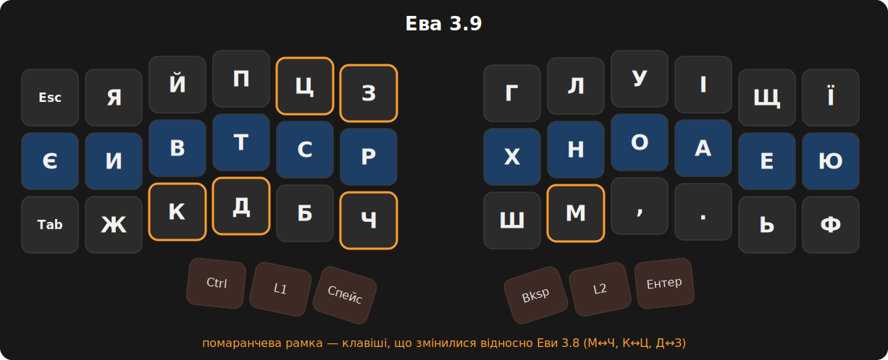
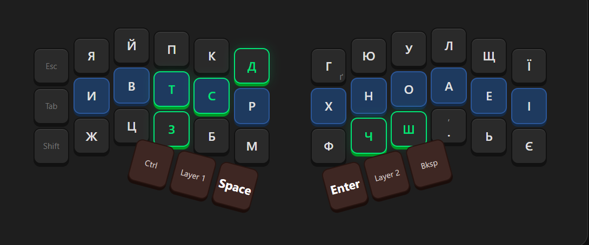
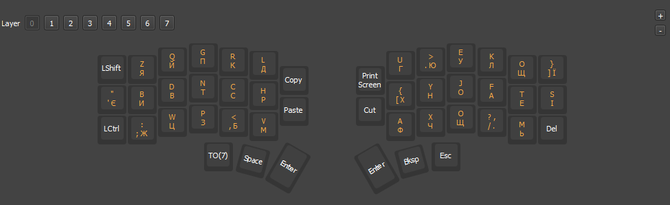
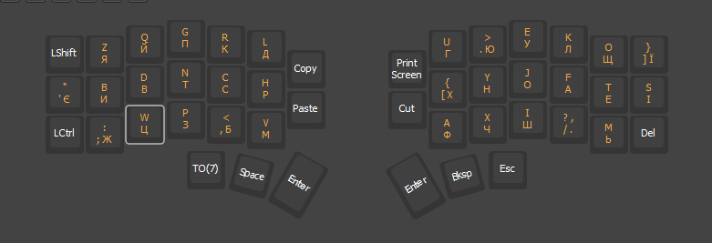
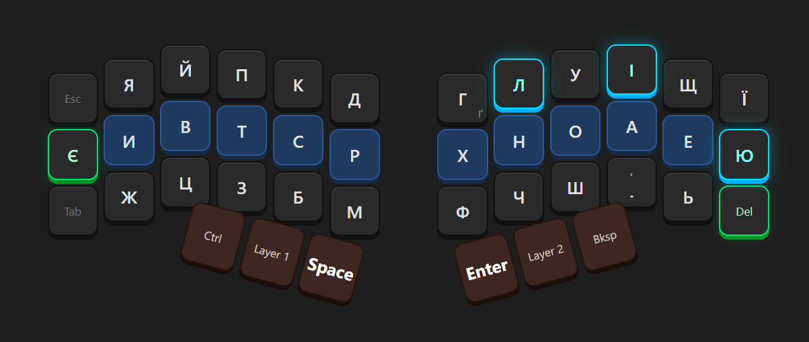
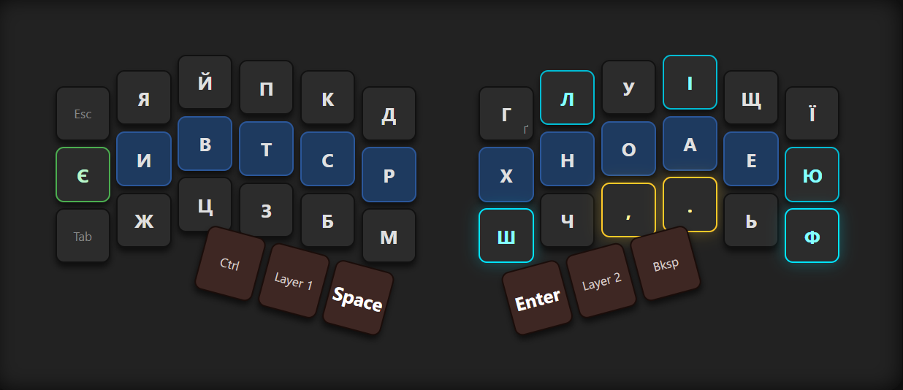
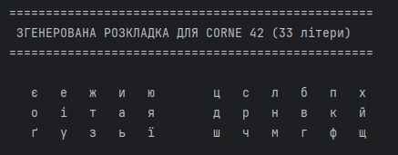
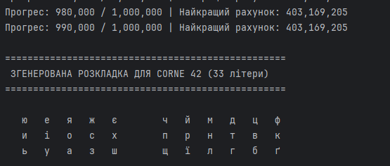
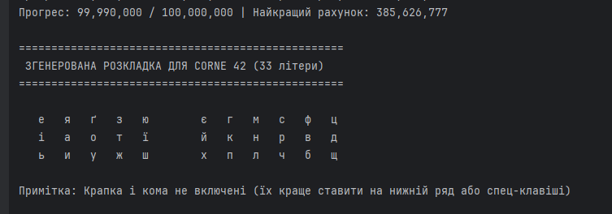
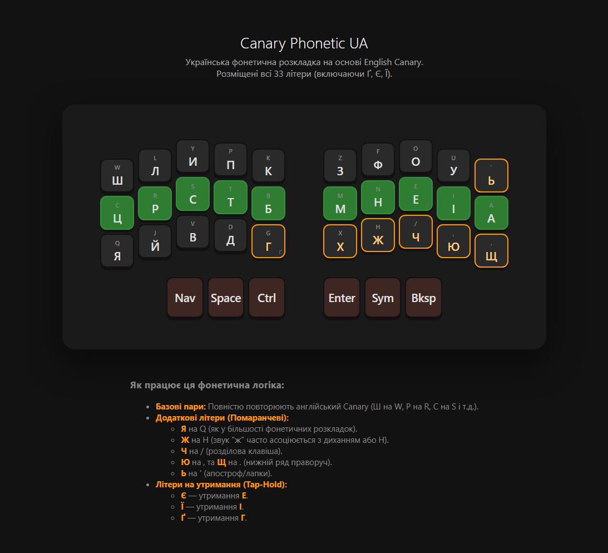

# 🇺🇦 Українські ергономічні розкладки «Ева» та «Ліна»

Ергономічні розкладки для набору українською на спліт-клавіатурах
(Corne/crkbd, Kyria, Lily58, Sofle та інших колонково-ступінчастих або ортолінійних бордах).

Якщо ви пробували [Colemak](https://colemak.com/), Colemak-DH, Dvorak, Workman чи
[Canary](https://github.com/Apsu/Canary) — ви знаєте, наскільки важлива оптимізація рухів пальців.
Цей репозиторій переносить ці практики на український алфавіт: тут є готові розкладки,
історія їхньої еволюції, Python-оптимізатор для генерації власної розкладки та
аналізатор, який рахує метрики на вашому корпусі текстів.

## Зміст

- [Чому ЙЦУКЕН незручна на 40 % клавіатурах](#-чому-йцукен-незручна-на-40--клавіатурах)
- [Метрики: цифри замість обіцянок](#-метрики-цифри-замість-обіцянок)
- [«Ева» — ручна оптимізація](#-гілка-ева--ручна-оптимізація-рекомендовано)
- [Встановлення (Vial)](#-встановлення-evavil-у-vial)
- [Історія еволюції «Еви»](#-історія-еволюції-еви)
- [«Ліна» — математична оптимізація](#-гілка-ліна--математична-оптимізація)
- [Canary Phonetic UA](#-canary-phonetic-ua-міст-між-мовами)
- [Як згенерувати розкладку під себе](#-як-згенерувати-розкладку-під-себе)
- [Пропозиції покращень](#-пропозиції-покращень)
- [Джерела](#-джерела)

## 🛑 Чому ЙЦУКЕН незручна на 40 % клавіатурах

Стандартна розкладка успадкована від друкарських машинок. На компактній
спліт-клавіатурі її проблеми видно в цифрах (корпус 6.2 млн літер, [analyzer.py](analyzer.py)):

- **Перевантаження вказівних пальців.** Лівий вказівний тримає К, Е, А, П, М, И — 29.7 %
  усіх натискань; правий — Н, Г, Р, О, Т, Ь — ще 29.9 %. **Разом два пальці роблять 59.6 % роботи.**
- **Високий SFB** (Same Finger Bigram — дві літери поспіль одним пальцем). У ЙЦУКЕН
  таких **18.3 % усіх біграм**: «ро», «но», «ор», «го», «то», «ка», «ки»…
  Це збиває ритм і втомлює суглоби.
- **Дисбаланс рук:** 54 % натискань на лівій руці, довгі серії на одній руці.

Щоб вирішити це, ми пішли двома шляхами: **«Ева»** (ручна, логічна оптимізація)
та **«Ліна»** (математична оптимізація кодом).

## 📊 Метрики: цифри замість обіцянок

Пораховано скриптом [analyzer.py](analyzer.py) на змішаному корпусі з **6.2 млн літер**
трьох жанрів: збалансований письмовий ([Brown-UK](https://github.com/brown-uk/corpus)),
розмовний ([субтитри OpenSubtitles](https://opus.nlpl.eu/OpenSubtitles.php)) та
енциклопедичний (українська Вікіпедія). Модель чесна: внутрішня колонка належить
вказівному пальцю, біграми рахуються лише всередині слів (пробіл на великому пальці
розриває їх).

| Розкладка | SFB % ↓ | Чергування рук % ↑ | Домашній ряд % ↑ | Мізинці % ↓ |
|---|---|---|---|---|
| ЙЦУКЕН | 18.30 | 54.2 | 43.9 | 9.4 |
| Ева 3.8 | 2.92 | 57.1 | 58.3 | 19.9 |
| **Ева 3.9** | **1.96** | 55.4 | **58.3** | 19.9 |
| Ліна | 0.97 | 74.9 | 53.8 | 24.5 |
| Canary Phonetic UA | 5.15 | 56.7 | 47.1 | 14.8 |

**Ева 3.9 має у 9 разів менше SFB, ніж ЙЦУКЕН**, і тримає 58 % набору на домашньому ряду.
Плата — навантаженіші мізинці (И та Е живуть на мізинцях). Ліна виграє в SFB і чергуванні,
але перевантажує мізинці ще більше — див. [пропозиції покращень](ПРОПОЗИЦІЇ.md).

## 👑 Гілка «Ева» — ручна оптимізація (рекомендовано)

«Ева» створювалася людиною для людини: частотний аналіз української, чергування рук
(приголосні здебільшого зліва, основні голосні О-А-Е-У-І — під правою рукою)
та зручні перекати (rolls).

### 🏆 Найкращий вибір: Ева 3.9

Найновіша версія — результат кількісного аудиту Еви 3.8 (методика й цифри — у
[ПРОПОЗИЦІЇ.md](ПРОПОЗИЦІЇ.md)). Три обміни поза домашнім рядом — **М↔Ч, К↔Ц, Д↔З** —
розвели найчастіші конфлікти одного пальця («кр», «ск», «чн», «др»):
SFB впав з 2.92 % до **1.96 %** (−33 %), а домашній ряд (58.3 %), мізинці та
голосний блок Н-О-А-Е лишилися рівно тими самими. Перевчання мінімальне: всі шість
змінених літер — на верхньому/нижньому рядах. Файл розкладки: [Eva-3.9.vil](Eva-3.9.vil)

<p align="center">
  
</p>

```text
[   ] [ Я ] [ Й ] [ П ] [ Ц ] [ З ]        [ Г ] [ Л ] [ У ] [ І ] [ Щ ] [ Ї ]
[ Є ] [ И ] [ В ] [ Т ] [ С ] [ Р ]        [ Х ] [ Н ] [ О ] [ А ] [ Е ] [ Ю ]
[   ] [ Ж ] [ К ] [ Д ] [ Б ] [ Ч ]        [ Ш ] [ М ] [ , ] [ . ] [ Ь ] [ Ф ]
```

Звикли до 3.8? Вона нікуди не зникає: файл [Eva.vil](Eva.vil), схема — в
[історії еволюції](#-історія-еволюції-еви) нижче.

Літери, яких не видно на схемі:

- **Ґ** — утримання клавіші **Г** (tap-hold);
- **апостроф** — комбо (одночасне натискання) **И + В**;
- цифри та символи — на окремому шарі (Layer 2).

## 🔧 Встановлення Eva.vil у Vial

1. Прошийте клавіатуру [Vial](https://get.vial.today/)-сумісною прошивкою.
2. Відкрийте програму Vial → **File → Load saved layout** → виберіть `Eva-3.9.vil`
   (або `Eva.vil`, якщо хочете класичну 3.8).
3. Увімкніть у системі **українську розкладку** — шар 0 надсилає системні сканкоди,
   тож ОС має інтерпретувати їх як ЙЦУКЕН (файл робить решту).
4. Для перемикання мов у файлі є макроси: **M0** = `Ctrl+0` + перехід на шар 0 (українська),
   **M1** = `Ctrl+1` + шар 1 (англійська Canary). Призначте `Ctrl+0`/`Ctrl+1` гарячими
   клавішами зміни мови у вашій ОС або замініть макроси на свої (`Alt+Shift`, `Win+Space`).

Шари у файлі: **0** — Ева (українська), **1** — англійська Canary, **2** — цифри й символи,
**7** — службовий (перемикання шарів). Комбо на шарі 0 дають апостроф, дужки, тире тощо.

> Комбо в `Eva-3.9.vil` прив'язані до літер, тому після обмінів працюють далі, але два
> жести (з+б та к+п) фізично опинилися на інших клавішах — за бажання перепризначте
> їх у Vial на зручніші пари.

> ⚠️ `Eva.vil` — мій особистий конфіг для плати з додатковими клавішами (46 активних
> позицій: PrtScr, Tab, Copy/Paste тощо; Ї/Ю/Ф у Vial-матриці підключені в четвертому
> ряду). На стандартному Corne 42 розкладка працює, але службові клавіші доведеться
> розставити під себе. Схема вище показує основну зону 3×6+3×6.

## 📜 Історія еволюції «Еви»

Розкладка не стала такою за один день:

- **Ева 3.0 — аналіз біграм.** Перша серйозна спроба розвести найчастіші біграми
  («сп», «тр», «нш») для комфортних перекатів.

  

  ```text
  [   ] [ Я ] [ Й ] [ П ] [ К ] [ Д ]        [ Г ] [ Ю ] [ У ] [ Л ] [ Щ ] [ Ї ]
  [   ] [ И ] [ В ] [ Т ] [ С ] [ Р ]        [ Х ] [ Н ] [ О ] [ А ] [ Е ] [ І ]
  [   ] [ Ж ] [ Ц ] [ З ] [ Б ] [ М ]        [ Ф ] [ Ч ] [ Ш ] [ . ] [ Ь ] [ Є ]
  ```

- **Ева 3.2 — пунктуація та периферія.** Початок експериментів з розділовими знаками
  та розміщенням рідкісних літер на краях; Є переїхала на лівий мізинець.

  

- **Ева 3.6 — робота над шарами.** Основна матриця лишилася як у 3.2, змінилася
  логіка додаткових шарів і службових клавіш.

  

- **Ева 3.7 — майже фінал.** І, Ю, Л знайшли свої місця (І в центрі верхнього ряду,
  Ю на мізинці), але кома та крапка ще потребували змін.

  

  ```text
  [   ] [ Я ] [ Й ] [ П ] [ К ] [ Д ]        [ Г ] [ Л ] [ У ] [ І ] [ Щ ] [ Ї ]
  [   ] [ И ] [ В ] [ Т ] [ С ] [ Р ]        [ Х ] [ Н ] [ О ] [ А ] [ Е ] [ Ю ]
  [   ] [ Ж ] [ Ц ] [ З ] [ Б ] [ М ]        [ Ф ] [ Ч ] [ Ш ] [ , ] [ Ь ]
  ```

- **Ева 3.8 — ідеальна пунктуація.** З основної зони прибрано Delete — кома та крапка
  стали на зручні позиції нижнього ряду. Довгий час була рекомендованою версією
  (файл: [Eva.vil](Eva.vil)).

  

  ```text
  [   ] [ Я ] [ Й ] [ П ] [ К ] [ Д ]        [ Г ] [ Л ] [ У ] [ І ] [ Щ ] [ Ї ]
  [ Є ] [ И ] [ В ] [ Т ] [ С ] [ Р ]        [ Х ] [ Н ] [ О ] [ А ] [ Е ] [ Ю ]
  [   ] [ Ж ] [ Ц ] [ З ] [ Б ] [ М ]        [ Ш ] [ Ч ] [ , ] [ . ] [ Ь ] [ Ф ]
  ```

- **Ева 3.9 — кількісний аудит** (див. вище). Аналіз на корпусі 6.2 млн літер показав,
  що всі найчастіші SFB (кр, ск, чн, др) можна розвести трьома обмінами поза домашнім
  рядом: М↔Ч, К↔Ц, Д↔З. SFB −33 % без жодних втрат у решті метрик.

## 🤖 Гілка «Ліна» — математична оптимізація

Після створення логічної бази ми запитали себе: а що вирішить чиста математика?
[main.py](main.py) — оптимізатор на основі **імітації відпалу** (simulated annealing):
він сотні тисяч разів міняє літери місцями на віртуальній клавіатурі, «друкує» ваш
корпус і шукає розстановку з мінімальним зусиллям та мінімальним SFB.

> Чесне уточнення: алгоритм розставляє лише 33 літери. Кому та крапку на клавіші
> великих пальців ми винесли вручну — це дизайнерське рішення, а не висновок коду.

Еволюція результату з ростом кількості ітерацій:

- **10 000 ітерацій** — розкладка ще хаотична:

  

- **1 000 000 ітерацій** — голосні групуються, конфлікти тануть:

  

- **10 000 000 ітерацій** — фінальна версія:

  

  ```text
  [ Е ] [ Я ] [ Ґ ] [ З ] [ Ю ]        [ Є ] [ Г ] [ М ] [ С ] [ Ф ] [ Ц ]
  [ І ] [ А ] [ О ] [ Т ] [ Ї ]        [ Й ] [ К ] [ Н ] [ Р ] [ В ] [ Д ]
  [ Ь ] [ И ] [ У ] [ Ж ] [ Ш ]        [ Х ] [ П ] [ Л ] [ Ч ] [ Б ] [ Щ ]
  ```

SFB у Ліни — 0.97 %, чергування рук — 75 %. Слабке місце — 24.5 % навантаження на
мізинці. Перша версія оптимізатора мала дві помилки в моделі (виправлені в поточному
`main.py`); перегенерована «Ліна 2.0» з удвічі меншим SFB і легкими мізинцями —
у [ПРОПОЗИЦІЇ.md](ПРОПОЗИЦІЇ.md).

## 🦜 Canary Phonetic UA: міст між мовами

Спеціалізована розкладка для тих, хто 70 %+ часу друкує англійською
(код, документація, термінал), але хоче комфортно перемикатися на українську.

Головна проблема зміни мови — злам м'язової пам'яті: мозок знає, що під правим
вказівним лежить N, а система видає йому Т (як у ЙЦУКЕН). Canary Phonetic UA
розв'язує це **фонетичною відповідністю** до англійської розкладки
[Canary](https://github.com/Apsu/Canary): та сама клавіша — той самий звук.

- **Центральний блок збігається:** англійські N-E-I-A стають українськими Н-Е-І-А.
- **Фонетичні пари приголосних:** W→Ш, L→Л, R→Р, S→С, T→Т, B→Б, P→П, V→В, D→Д, M→М…
- **Літери без прямих аналогів** отримали логічні слоти: Я на Q (традиція фонетичних
  розкладок), Ж на H, Ь на апострофі, Ю та Щ — на позиціях коми та крапки.
- **Tap-hold:** Є = утримання Е, Ї = утримання І, Ґ = утримання Г.

<p align="center">
  
</p>

Результат: пальці рухаються тими самими траєкторіями для тих самих звуків,
перемикання мови не ламає звичок. Чесна ціна: SFB 5.15 % — вищий, ніж у Еви
(фонетичні позиції І та С ділять один палець із В та И — біграми «ви», «ис», «си»).
Якщо українська для вас основна — беріть Еву; Canary Phonetic UA — для
переважно англомовного робочого дня.

> Прим.: за основу взято гібрид ANSI- та matrix-версій Canary, адаптований під
> колонково-ступінчасту геометрію.

## 💻 Як згенерувати розкладку під себе

Оптимізатор налаштовується під ваш стиль письма:

1. Створіть папку `corpus_texts` поруч зі скриптом `main.py`.
2. Покладіть туди `.txt` файли: експорт чатів Telegram, улюблені книги, робочі
   тексти — що більше, то краще (мінімум ~100 000 літер).
3. Запустіть:

   ```bash
   python main.py
   # або з параметрами:
   python main.py --iterations 500000 --restarts 4 --seed 42
   ```

Скрипт працює на чистому Python 3 без залежностей, виводить розкладку в термінал
і зберігає в `layout_result.txt` разом із метриками. Порівняти з готовими розкладками:

```bash
python analyzer.py corpus_texts/мій_текст.txt
```

## 🛠 Рекомендації для прошивки (QMK/ZMK/Vial)

- **Home Row Mods:** повісьте Shift/Ctrl/Alt/Win на утримання літер домашнього ряду —
  мізинцям не доведеться тягнутися до модифікаторів.
- **Комбо:** одночасне натискання двох сусідніх клавіш для апострофа, бекспейсу,
  дужок (у `Eva.vil` вже налаштовано десяток таких).

## 💡 Пропозиції покращень

Кількісний аудит розкладок і конкретні варіанти з цифрами — у
[ПРОПОЗИЦІЇ.md](ПРОПОЗИЦІЇ.md): «Ева 3.9» (три обміни поза домашнім рядом:
−42 % SFB при незмінному домашньому ряді), «Ева 3.9+» (мінімальний SFB)
та «Ліна 2.0» (перегенерована чесною моделлю).

## 🤝 Внесок

Ергономіка — нескінченний процес. Тестуйте Еву 3.8, експериментуйте з Ліною,
рахуйте метрики на своїх текстах — і діліться результатами через Issue або Pull Request.
Зробимо український друк швидким і зручним! 🇺🇦⌨️

## 📚 Джерела

- [Canary keyboard layout](https://github.com/Apsu/Canary) — оригінальна англійська Canary (Apsu та спільнота AKL).
- [Keyboard layouts doc](https://bit.ly/keyboard-layouts-doc) — довідник спільноти альтернативних розкладок (SFB, rolls, alternation).
- [Vial](https://get.vial.today/) — конфігуратор прошивки.
- Частотні дані (6.2 млн літер): [Brown-UK](https://github.com/brown-uk/corpus) — збалансований корпус української,
  [OpenSubtitles UA](https://opus.nlpl.eu/OpenSubtitles.php) — розмовний стиль,
  випадкові статті [української Вікіпедії](https://uk.wikipedia.org/); скрипт [analyzer.py](analyzer.py).

## 📄 Ліцензія

[MIT](LICENSE) — використовуйте, модифікуйте, діліться.
